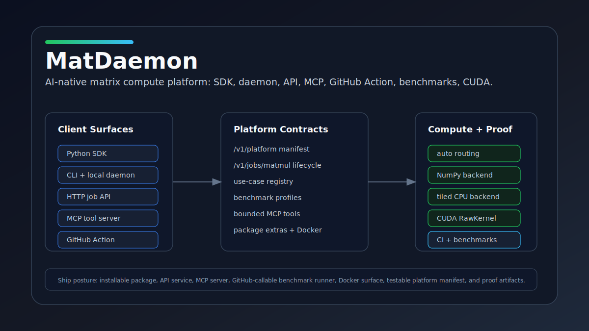
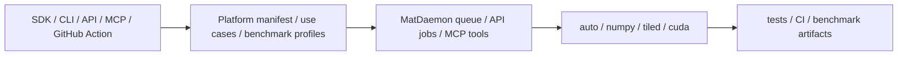

<p align="center">
  
</p>

<h1 align="center">MatDaemon</h1>

<p align="center">
  AI-native matrix compute platform for agents, RAG systems, simulations, and ML automation.
</p>

<p align="center">
  <a href="https://www.python.org/downloads/"></a>
  <a href="LICENSE"></a>
  <a href="#mcp-server"></a>
  <a href="#http-mini-platform"></a>
  <a href="#github-callable-benchmarks"></a>
  <a href="#cuda-backend"></a>
</p>

MatDaemon packages matrix multiplication as a real product surface: Python SDK, async in-process daemon, CLI, HTTP job API, MCP server, GitHub Action, benchmark harness, Docker API surface, and optional CUDA RawKernel backend.

It is built for AI systems that need a small, callable compute layer without bringing in a full ML framework or inventing a one-off matrix service for every agent, RAG pipeline, simulation, or automation worker.

## Why It Exists

AI products keep needing the same matrix operations in different places: embedding similarity, memory routing, projection, attention-style score blocks, simulation transitions, and benchmarkable local compute. MatDaemon turns that repeated work into one installable platform with clear contracts and proof artifacts.

## Install

```bash
pip install matdaemon
pip install "matdaemon[api]"   # HTTP API surface
pip install "matdaemon[mcp]"   # MCP server surface
pip install "matdaemon[cuda]"  # optional CUDA host support
```

From source:

```bash
git clone https://github.com/ItsNotAILABS/MatDaemon.git
cd MatDaemon
python -m pip install -e .[dev,api,mcp]
pytest -q
```

## Platform Surfaces

| Surface | Entry point | Production use |
| --- | --- | --- |
| SDK | `import matdaemon as md` | embed matrix compute in Python agents and pipelines |
| Daemon | `md.MatDaemon()` | queue in-process async matrix jobs |
| CLI | `matdaemon matmul`, `matdaemon benchmark`, `matdaemon platform` | local operator and CI workflows |
| HTTP API | `matdaemon serve` | sync and async matrix jobs over FastAPI |
| MCP Server | `matdaemon mcp` | tool-calling AI clients over stdio |
| GitHub Action | `.github/actions/matdaemon-benchmark` | benchmark MatDaemon from GitHub Actions |
| CUDA Backend | `backend="cuda"` | optional CuPy RawKernel GEMM on GPU hosts |

## First Run

```python
import numpy as np
import matdaemon as md

A = np.random.randn(1024, 1024).astype(np.float32)
B = np.random.randn(1024, 1024).astype(np.float32)
C = md.matmul(A, B, backend="auto")
```

Inspect the platform contract from the SDK or CLI:

```bash
matdaemon platform
```

```python
import matdaemon as md

manifest = md.get_platform_manifest()
print(manifest["surfaces"])
```

## HTTP Mini Platform

Run the API:

```bash
matdaemon serve --host 0.0.0.0 --port 8000
```

Discover the product contract:

```bash
curl http://localhost:8000/v1/platform
curl http://localhost:8000/v1/use-cases
```

Submit an async matrix job:

```bash
curl -X POST http://localhost:8000/v1/jobs/matmul \
  -H 'content-type: application/json' \
  -d '{"a": [[1, 2], [3, 4]], "b": [[5, 6], [7, 8]], "backend": "numpy", "use_case": "agent-memory-routing"}'
```

Poll and fetch result:

```bash
curl http://localhost:8000/v1/jobs/<job_id>
curl http://localhost:8000/v1/jobs/<job_id>/result
```

Use the synchronous endpoint for simple calls:

```bash
curl -X POST http://localhost:8000/v1/matmul \
  -H 'content-type: application/json' \
  -d '{"a": [[1, 2]], "b": [[3], [4]], "backend": "auto"}'
```

Docker:

```bash
docker compose up --build
```

## MCP Server

```bash
matdaemon mcp
```

MCP tools:

| Tool | Use |
| --- | --- |
| `matdaemon_matmul` | multiply matrices and return result plus timing metadata |
| `matdaemon_similarity_top_k` | rank candidate embeddings for local RAG or memory routing |
| `matdaemon_use_cases` | list AI use cases and recommended backend shape |
| `matdaemon_platform_manifest` | return product surfaces, runtime stack, and proof gates |

Client config shape:

```json
{
  "command": "matdaemon",
  "args": ["mcp"]
}
```

See [docs/MCP.md](docs/MCP.md).

## GitHub Callable Benchmarks

```yaml
- uses: ItsNotAILABS/MatDaemon/.github/actions/matdaemon-benchmark@main
  with:
    profile: ai
    backends: numpy tiled
    repetitions: "1"
    strict: "true"
```

The action produces JSON and Markdown benchmark artifacts that can be attached to releases, issues, launch posts, or hardware proof notes. See [docs/GITHUB_ACTION.md](docs/GITHUB_ACTION.md).

## AI Use Cases

| Use case | Shape | Recommended backend |
| --- | --- | --- |
| Agent memory routing | `queries[M, D] @ memories[N, D].T` | `auto` |
| Local RAG similarity | `queries[M, D] @ docs[N, D].T` | `auto` |
| Embedding projection | `embeddings[B, Din] @ weights[Din, Dout]` | `numpy` |
| Attention-style score blocks | `Q[T, D] @ K[S, D].T` | `tiled` |
| Simulation worker steps | `state[M, K] @ transition[K, N]` | `auto` |

Examples:

```bash
python examples/agent_embedding_router.py
python examples/local_rag_similarity.py
```

## Benchmarks

```bash
python benchmarks/benchmark_suite.py --quick
python benchmarks/benchmark_suite.py --profile ai --backends auto numpy tiled --output benchmarks/results-ai
python benchmarks/benchmark_suite.py --profile launch --backends numpy tiled --strict --output benchmarks/results
```

When `--output` is provided, MatDaemon writes:

- `benchmark-results.json`
- `benchmark-results.md`

## CUDA Backend

MatDaemon preserves the specialized CUDA RawKernel backend under:

```text
backends/cuda_backend.py
```

The legacy misspelled path remains as a compatibility shim:

```text
backends/cude_backend.py
```

CPU installs stay lightweight. CUDA imports are optional and only required when `backend="cuda"` is requested on a compatible GPU host.

## Runtime Stack



## Production Proof Gates

| Gate | Evidence |
| --- | --- |
| Correctness | matrix outputs tested against expected NumPy-compatible results |
| Platform | health, manifest, use cases, sync jobs, and async jobs covered by API tests |
| Agent surface | MCP module imports without optional dependency and exposes bounded tools when installed |
| Benchmark | suite writes JSON and Markdown artifacts with strict failure mode |
| Packaging | package extras, console script, Dockerfile, docs, and GitHub Action surface |

## Docs

- [Platform guide](docs/PLATFORM.md)
- [MCP guide](docs/MCP.md)
- [GitHub Action guide](docs/GITHUB_ACTION.md)
- [Benchmark guide](docs/BENCHMARKING.md)
- [Product surface](docs/PRODUCT.md)
- [Launch checklist](docs/LAUNCH.md)
- [Repository metadata](docs/METADATA.md)

## License

MIT License.
