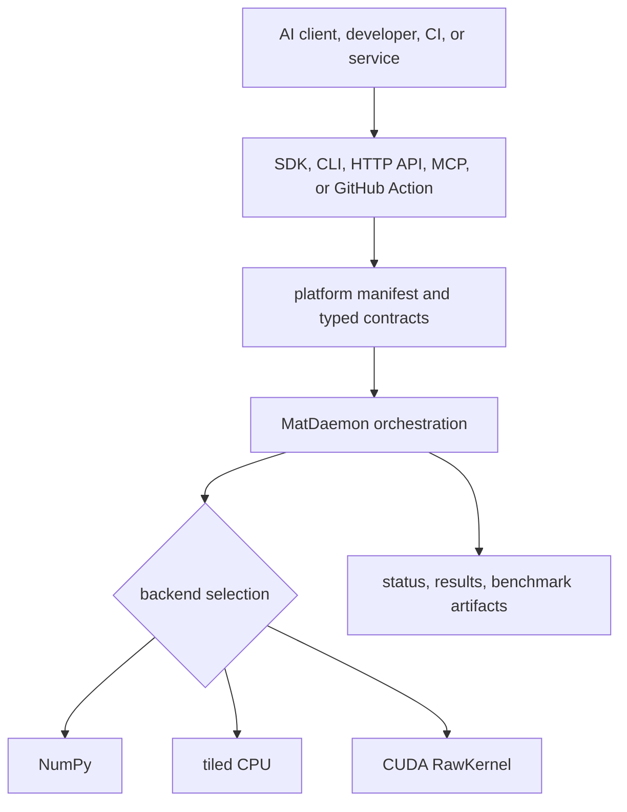

# MatDaemon Platform Guide

MatDaemon is a mini compute platform packaged as a Python project. The product is not only `matmul`; it is the collection of callable surfaces, contracts, runtime routes, proof gates, and operator workflows around matrix compute for AI systems.


## Platform Contract

The platform contract is exposed from one shared manifest:

```bash
matdaemon platform
curl http://localhost:8000/v1/platform
```

```python
import matdaemon as md

manifest = md.get_platform_manifest()
```

The manifest includes:

- product name, version, status, and tagline
- SDK, daemon, CLI, API, MCP, GitHub Action, and CUDA surfaces
- runtime stack layers
- AI use-case registry
- proof gates
- install commands
- operator commands

## Runtime Architecture



## Operator Surfaces

| Operator | Surface | Command or contract |
| --- | --- | --- |
| Developer | SDK | `md.matmul(A, B, backend="auto")` |
| Agent runtime | MCP | `matdaemon_matmul`, `matdaemon_similarity_top_k` |
| Service caller | HTTP API | `POST /v1/jobs/matmul`, `GET /v1/jobs/{job_id}` |
| Maintainer | GitHub Action | `.github/actions/matdaemon-benchmark` |
| GPU operator | CUDA backend | `backend="cuda"` |
| Release operator | Benchmark suite | `benchmark-results.json`, `benchmark-results.md` |

## HTTP API

Run the service:

```bash
python -m pip install -e .[api]
matdaemon serve --host 0.0.0.0 --port 8000
```

Core endpoints:

| Endpoint | Method | Purpose |
| --- | --- | --- |
| `/health` | `GET` | service health and job counters |
| `/v1/platform` | `GET` | product manifest and runtime contract |
| `/v1/use-cases` | `GET` | AI use-case registry |
| `/v1/matmul` | `POST` | synchronous matrix multiplication |
| `/v1/jobs/matmul` | `POST` | create async matrix job |
| `/v1/jobs/{job_id}` | `GET` | poll job status |
| `/v1/jobs/{job_id}/result` | `GET` | fetch completed result |

Async job flow:

```bash
curl -X POST http://localhost:8000/v1/jobs/matmul \
  -H 'content-type: application/json' \
  -d '{"a": [[1, 2], [3, 4]], "b": [[5, 6], [7, 8]], "backend": "numpy", "use_case": "agent-memory-routing"}'

curl http://localhost:8000/v1/jobs/<job_id>
curl http://localhost:8000/v1/jobs/<job_id>/result
```

## MCP Server

Run the server:

```bash
python -m pip install -e .[mcp]
matdaemon mcp
```

MCP tools:

- `matdaemon_matmul`
- `matdaemon_similarity_top_k`
- `matdaemon_use_cases`
- `matdaemon_platform_manifest`

Security posture: the MCP server exposes bounded matrix compute and discovery helpers. It does not execute shell commands, read arbitrary files, or access network resources.

## Docker

```bash
docker compose up --build
curl http://localhost:8000/v1/platform
```

## GitHub Actions

Use **Actions -> matdaemon-benchmark -> Run workflow** to execute benchmark profiles from GitHub and download JSON/Markdown artifacts.

See [GITHUB_ACTION.md](GITHUB_ACTION.md).

## Production Posture

Current production-ready surfaces:

- installable Python package metadata and optional extras
- SDK and daemon APIs
- CLI for local operator workflows
- FastAPI mini platform with sync and async jobs
- MCP server for AI clients
- GitHub Action benchmark runner
- Docker API surface
- benchmark suite with strict mode and artifact output
- CUDA backend preserved as optional GPU path
- CI-covered platform manifest and API lifecycle

## Next Production Gates

These are future hardening gates, not blockers for shipping the current package:

- persistent external job queue for multi-process deployments
- result artifact storage for large matrix outputs
- streaming progress and cancellation
- hosted demo endpoint
- signed release artifacts
- GPU runner benchmark table
