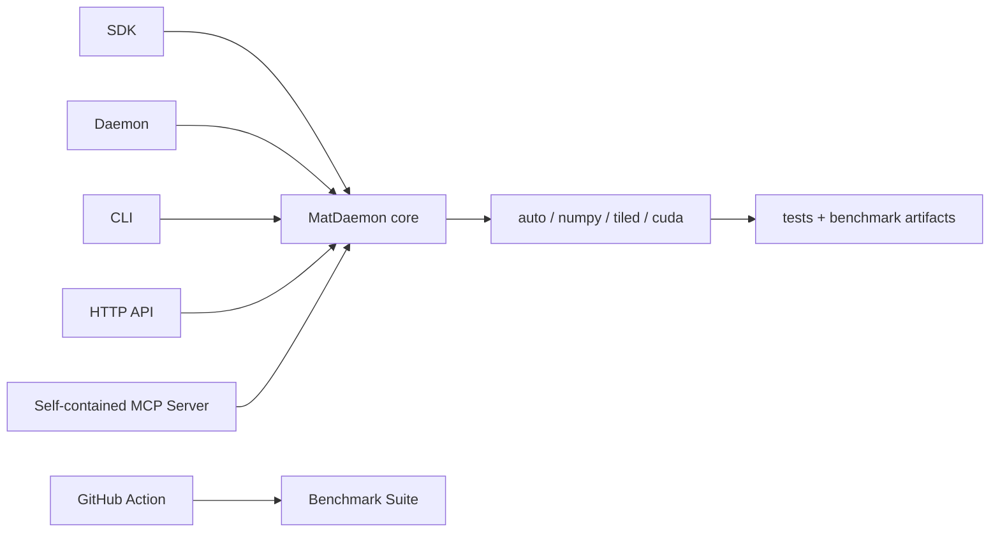

# MatDaemon Product Surface

MatDaemon is a shippable AI-native matrix compute platform. It packages the compute core, operator workflows, AI-callable tool surfaces, benchmark proof, and deployment scaffolding into one focused repository.

## Product Definition

MatDaemon gives agents and developers a compact matrix compute substrate with:

- Python SDK for direct integration
- in-process daemon for async local jobs
- CLI for operator workflows and smoke benchmarks
- FastAPI mini platform for remote sync and async matrix jobs
- self-contained MCP server for tool-calling AI clients and coding platforms
- GitHub Action for benchmark proof from CI
- Docker API surface for local service runs
- optional CUDA RawKernel backend for GPU hosts

## Product Architecture

## First Customer Flow

1. Install from source until PyPI release is published.
2. Run `matdaemon platform` to inspect the product contract.
3. Call `md.matmul(A, B, backend="auto")` in Python.
4. Run `matdaemon serve` when a local or remote service surface is needed.
5. Run `matdaemon mcp` when an AI client or coding platform needs tool access.
6. Run the benchmark suite or GitHub Action to generate proof artifacts for the machine.

## AI Customer Flows

| Flow | Surface | Why it matters |
| --- | --- | --- |
| Agent memory router | MCP or SDK | score query embeddings against memory matrices |
| Local RAG similarity | MCP, SDK, or API | rank documents without adding a vector database dependency |
| Coding assistant setup | MCP | discover platform, validate matrices, generate API payloads, generate GitHub Actions snippets |
| Simulation worker | daemon or API | execute repeated matrix transitions as jobs |
| CI benchmark proof | GitHub Action | publish machine-specific JSON and Markdown results |
| GPU host check | CUDA backend | validate RawKernel path where CUDA exists |

## Product Boundary

MatDaemon is not a general ML framework, model server, vector database, or workflow engine. It is a matrix compute platform that can be embedded inside those systems.

That boundary is valuable: the repo stays small enough to install quickly, inspect easily, benchmark honestly, and call from AI tools without granting broad execution power.

## Production Proof

Current proof surfaces:

- unit tests for matrix correctness and backend behavior
- API lifecycle tests for health, manifest, use cases, sync jobs, and async jobs
- MCP tests for initialize, tool listing, matrix execution, and payload generation
- AI surface tests for use cases and platform discovery
- benchmark suite with JSON and Markdown outputs
- GitHub Action for repeatable benchmark runs
- Dockerfile and compose surface for API startup

## Release Positioning

Suggested launch line:

> MatDaemon is an AI-native matrix compute platform: SDK, daemon, CLI, HTTP API, self-contained MCP server, GitHub Action, benchmarks, and optional CUDA RawKernel backend for agents, RAG, simulations, and ML automation.

## Next Product Gates

- publish PyPI package
- tag `v0.3.1`
- run CPU benchmark artifact on GitHub Actions
- run CUDA benchmark artifact on a GPU host
- add hosted demo endpoint when infrastructure is available
